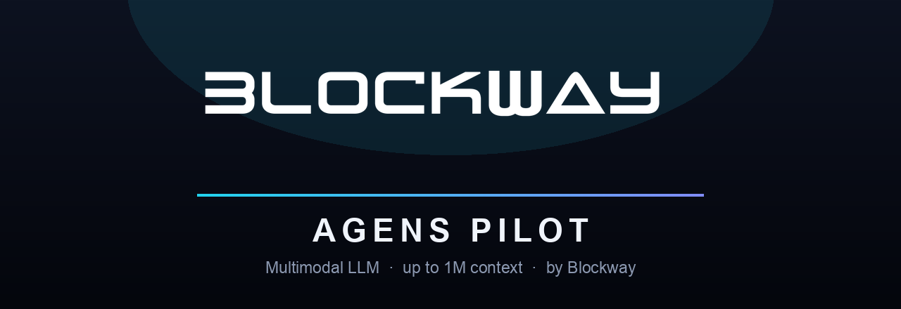

<p align="center">
  
</p>

<p align="center">
  <b>A coding-first, multimodal, 1&nbsp;million-token LLM</b> — built by <a href="https://blockway.io">Blockway</a><br>
  <i>Connecting technologies &amp; scenarios to create a trusted future</i>
</p>

<p align="center">
  
  
  
  
  
</p>

<p align="center">
  🤗 <b>Weights on Hugging Face:</b>
  <a href="https://huggingface.co/Blockway/Agens-Pilot">BF16</a> ·
  <a href="https://huggingface.co/Blockway/Agens-Pilot-FP8">FP8</a> ·
  <a href="https://huggingface.co/Blockway/Agens-Pilot-Int4">INT4</a>
</p>

---

## Meet Agens Pilot

**Agens Pilot** is Blockway's flagship open model: a 27-billion-parameter multimodal LLM
that writes code like a much larger model, reads a **whole repository in one context window**,
sees images, and speaks English, 廣東話, 简体中文 and 繁體中文 fluently.

It is engineered for **agents that do real work** — long-horizon coding, tool use, and
multi-step reasoning — and ships in three precision builds so you can run it on anything from
a multi-GPU server to a single high-end card.

- **Developer:** Blockway (BlockWay Link Limited · 博睿鏈科有限公司), Hong Kong · founded 2018
- **Website:** https://blockway.io
- **Model type:** Decoder-only multimodal LLM (text + vision), ~27B params, hybrid attention (linear + full) for efficient long context
- **Context length:** up to **1,000,000 tokens** (262,144 native; extended to 1M with YaRN)
- **Languages:** English, Cantonese, Simplified & Traditional Chinese (and more)
- **License:** Apache-2.0 — commercial use welcome

---

## 🤖 Purpose-built for Blockway's agent harnesses

Agens Pilot isn't just a checkpoint — it's the engine **fine-fitted for Blockway's own
agent stacks**, so the model and the harness are tuned together:

| Harness | What it is | Status |
|---|---|---|
| **[Claway](https://claway.io)** | Blockway's **Team-AI workforce** — autonomous AI teammates that plan, use tools, and collaborate on knowledge and operations tasks. | **Live** |
| **Codeway** | Blockway's **coding agent** — repo-scale understanding, edit-and-verify loops, and agentic software delivery. | **Opening soon** 🚀 |

Because Agens is trained and evaluated against these harnesses' real workloads — long context,
strict instruction-following, reliable tool calls — you get an agent model that **behaves the
way an agent should out of the box**. It also runs anywhere OpenAI-compatible (sglang / vLLM),
so you're never locked in.

---

## Highlights

- ⚡ **Strong coding** — 97.0 HumanEval, ~83 LiveCodeBench v6; top-tier for a ~27B model.
- 📚 **Ultra-long context** — up to **1M tokens** for whole-repo and long-document work, kept
  affordable by a hybrid linear-attention design.
- 🛠️ **Agentic & tool use** — reliable function calling and multi-step tool workflows.
- ⚖️ **Balanced, factual answers** — discusses historical, political and factual topics
  neutrally and with multiple perspectives instead of deflecting.
- 🪪 **Consistent identity** — always self-identifies as Agens by Blockway.
- 🖼️ **Multimodal** — images alongside text: vision understanding, document & chart Q&A.
- 🧩 **Deploy your way** — BF16 / FP8 / INT4 official builds; Apache-2.0.

---

## How Agens Pilot compares

A capability-level positioning against a typical open model in the same ~27B class
(characteristics vary by model — verify against the specific model you're evaluating):

| | **Agens Pilot** | Typical open ~27B model |
|---|---|---|
| Context window | **up to 1,000,000 tokens** | 32K – 128K |
| Modality | **Text + Vision (native)** | usually text-only |
| Long-context efficiency | **hybrid linear + full attention** | full attention (costlier) |
| Official quantized builds | **FP8 + INT4** (compressed-tensors) | community-only, varies |
| First-party agent harness | **Claway + Codeway** | third-party frameworks only |
| Coding (HumanEval, internal) | **97.0** | — |
| License | **Apache-2.0** | varies (some restrictive) |

> Benchmark figures for Agens are from Blockway's internal harness (see *Evaluation*). The
> comparison column describes general characteristics of the segment, not a specific competitor.

---

## Model variants

All three builds share the same tokenizer, chat template and 1M-context configuration — they
differ only in weight precision.

| Variant | Repo | Size | Precision recipe | Quality | Suggested hardware |
|---|---|---|---|---|---|
| **BF16** | `Blockway/Agens-Pilot` | ~51 GB | full precision | reference | 2×48 GB or 4×24 GB |
| **FP8** ⭐ | `Blockway/Agens-Pilot-FP8` | ~34 GB | FP8 on feed-forward + full-attention; linear-attention, embeddings, LM head & vision kept in bf16 | **matches BF16** | 1×48 GB or 2×24 GB |
| **INT4** | `Blockway/Agens-Pilot-Int4` | ~26 GB | INT4 (GPTQ, group 128) on the same layers | very close; slightly softer on borderline factual topics | ≥32 GB VRAM, or 24 GB + CPU offload |

**Why the quantized builds aren't smaller.** For stability, the hybrid **linear-attention
layers** and the token **embeddings / LM head** are always kept in bf16 — quantizing the
linear-attention path degrades generation control. Only feed-forward and full-attention
weights are quantized.

> GGUF / Ollama / llama.cpp are **not** available yet: the hybrid architecture isn't supported
> by upstream llama.cpp. The INT4 build is the smallest usable form today.

> **On the reported "model size":** Hugging Face auto-detects the **INT4** build as ~11B. That's a
> counting artifact — packed 4-bit weights are stored 8-per-int32, so the widget under-counts them.
> All three builds are the **same ~27B model**; only the weight precision differs.

---

## Serving

Quantized builds are in `compressed-tensors` format and are auto-detected — no `--quantization`
flag needed.

```bash
python3 -m sglang.launch_server \
  --model-path <path-to-variant> \
  --served-model-name "Agens Pilot" \
  --tp-size 4 \
  --context-length 1048576 \
  --tool-call-parser qwen3_coder \
  --reasoning-parser qwen3 \
  --trust-remote-code \
  --host 0.0.0.0 --port 8000
# env: SGLANG_ALLOW_OVERWRITE_LONGER_CONTEXT_LEN=1   (to serve the full 1M context)
```

```bash
curl http://localhost:8000/v1/chat/completions \
  -H "Content-Type: application/json" \
  -d '{"model":"Agens Pilot","messages":[{"role":"user","content":"Write a Python is_prime(n)."}]}'
```

`tp-size` may be 1–4. FP8 fits 2×24 GB; INT4 fits a single ≥32 GB card (or 24 GB with `--cpu-offload-gb`).

<details>
<summary>transformers (bf16, text example)</summary>

```python
from transformers import AutoProcessor, AutoModelForImageTextToText

model = AutoModelForImageTextToText.from_pretrained(
    "Blockway/Agens-Pilot", torch_dtype="bfloat16", device_map="auto", trust_remote_code=True)
processor = AutoProcessor.from_pretrained("Blockway/Agens-Pilot", trust_remote_code=True)

messages = [{"role": "user", "content": "Write a Python function to check if a string is a palindrome."}]
text = processor.apply_chat_template(messages, tokenize=False, add_generation_prompt=True)
inputs = processor(text=text, return_tensors="pt").to(model.device)
out = model.generate(**inputs, max_new_tokens=512)
print(processor.decode(out[0][inputs.input_ids.shape[1]:], skip_special_tokens=True))
```
</details>

---

## Evaluation

Measured on Blockway's internal evaluation harness (single-sample, thinking enabled, temp 0.6).

| Benchmark | Agens Pilot |
|---|---|
| HumanEval (chat) | **97.0** |
| LiveCodeBench v6 | **~83** |
| IFBench (prompt-strict) | **61.0** |
| Tool-call selection | 16 / 16 |
| GPQA Diamond | 80.3 |
| RealWorldQA (vision) | 77.2 |
| ERQA (vision) | 57.8 |
| MathVision (vision) | 65.8 |

**Reading:** strongest on **coding and instruction-following**, solid on general reasoning and
everyday vision; visual mathematics (MathVision) is the weakest axis and on the roadmap.

### vs. recent open models (official reported scores)

| Benchmark | **Agens Pilot** | Llama 4 Scout · Meta | Mistral Small 3.1 · 24B | Gemma 3 · 27B |
|---|---|---|---|---|
| GPQA Diamond | **80.3** | 57.2 | 45.4 | 42.4 |
| HumanEval | **97.0** | — | ~88 | — |
| LiveCodeBench | **~83** | 32.8 | — | 29.7 |

Competitor figures are as officially published (Llama 4 Scout, Mistral Small 3.1, and Gemma 3
technical reports). Cross-harness comparison is approximate — Agens numbers are from Blockway's
internal harness with thinking enabled, and LiveCodeBench versions may differ.

Public leaderboards often use larger context budgets, richer answer extraction and external
judges, so absolute values aren't directly comparable across harnesses.

---

## Intended use

- Code generation, review, debugging and agentic coding workflows (Codeway-style).
- Autonomous AI teammates and multi-step operations (Claway-style).
- Multilingual assistance and reasoning; vision-language tasks (images, charts, documents).

Safety guardrails on universally-harmful requests (weapons, illicit harm, etc.) are in place.

**Use with care:** high-stakes decisions need human review; the model can make mistakes and
should not be treated as an authoritative source on contested topics — verify facts.

---

## Limitations

- **Visual mathematics (MathVision)** is the weakest area, on the improvement roadmap.
- Internal benchmark numbers are conservative and not directly comparable to other harnesses.
- Like all LLMs, Agens can hallucinate and should be fact-checked for important use.
- Reasoning is strongest in English and Chinese.
- The **INT4** build can be slightly less consistent than FP8/BF16 on borderline factual topics.

---

## License & citation

Released under the **Apache-2.0 license**. © 2026 BlockWay Link Limited (博睿鏈科有限公司).
See the accompanying `LICENSE` and `NOTICE` files. Training data used in development may carry
its own licenses; downstream users are responsible for their own compliance.

```bibtex
@misc{agenspilot2026,
  title  = {Agens Pilot: a coding-focused multimodal LLM},
  author = {Blockway (BlockWay Link Limited)},
  year   = {2026},
  url    = {https://blockway.io}
}
```

<p align="center">
  <b>Blockway</b> · 博睿鏈科有限公司 · Hong Kong · <a href="https://blockway.io">blockway.io</a><br>
  <i>Connecting technologies &amp; scenarios to create a trusted future</i>
</p>
